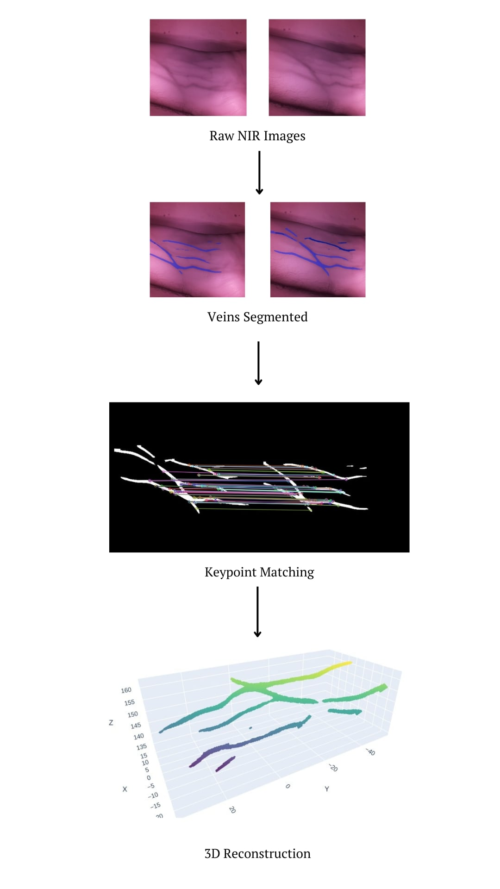

# 3D Vein Reconstruction from Stereo Cameras

This project reconstructs 3D vein structures using stereo image input from two Raspberry Pi cameras. 
It uses YOlo11n-seg model for segmentation, ORB for keypoint matching, and triangulation for 3D reconstruction.

## Installation

1. Clone the repository:
   ```bash
   git clone https://github.com/your-username/vein-reconstruction.git
   cd vein-reconstruction
    ```
2. Install dependencies:
   ```bash
   pip install requirements.txt
    ```

## Hardware & Calibration
Capture the checkboard images using calibration/capture_checkerboard.py and then calibrate the cameras using calibration/camera_calibration.py

## YOLO Segmentation Model
Export the trained Yolo11 model and place in the model/ folder.

## Run the Project
``` python main.py ```

## Performance Benchmarks
| Metric                   | Value                      |
|--------------------------|----------------------------|
| Frames per second (FPS)  | 4 FPS                      |
| Avg. keypoints matched   | 300                        |
| Calibration Error        | ~0.03                      |
| 3D Visualization         | 400 ms                     |

## Sample Results
<div align="center">

</div>
